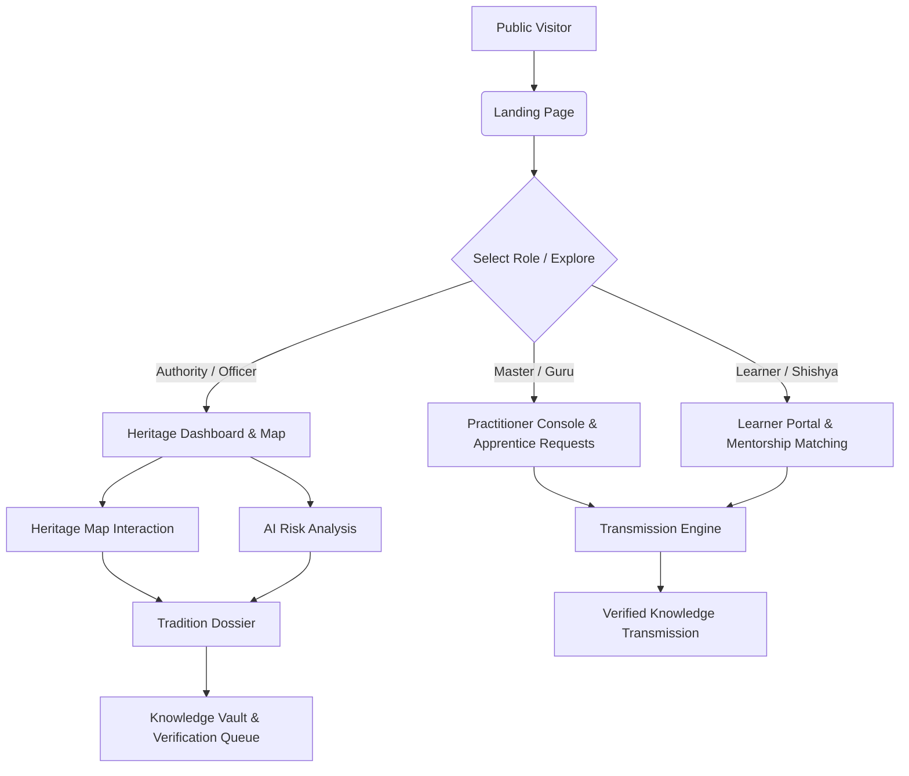

# Sanskriti Suraksha (संस्कृती सुरक्षा)
## AI-Powered Pan-India Living Heritage Early Warning & Knowledge Transmission System

[](https://react.dev/)
[](https://vitejs.dev/)
[](https://tailwindcss.com/)
[](LICENSE)

---

## 🏛️ Executive Summary

**Sanskriti Suraksha** is a digital safeguarding platform engineered to identify, monitor, and preserve India's intangible living cultural heritage (ICH). By synthesizing community crowdsourcing, multi-factor risk assessment, algorithmic gap analysis, and Guru-Shishya (master-to-apprentice) mentorship matchmaking, the platform provides cultural custodians, government bodies, master practitioners, and students with actionable tools to prevent cultural extinction.

### Core Safeguarding Pillars:
1. **Detect (शोध)**: Early warning indicators monitoring practitioner counts, average age, transmission frequency, and documentation scarcity.
2. **Explain (विश्लेषण)**: Granular risk factors, structural vulnerability assessments, and AI-assisted intervention roadmaps.
3. **Connect (संवाद)**: Bridging master artisans (Gurus) with verified apprentices (Shishyas) to ensure living oral and practical continuity.
4. **Preserve (संरक्षण)**: Multi-media community archiving, peer-validation review queues, and decentralized cultural knowledge vaults.

---

## 🗺️ Pan-India Living Heritage Map (Interactive GIS Engine)

The platform features an interactive **Pan-India Living Heritage Map** driven by high-fidelity cartography and responsive coordinate projection.

### Key Map Capabilities:
- **Authentic Political Cartography**: Replaced generic mock vectors with an authentic, state-by-state political map of India (`/images/india_map.jpg`), with clear administrative boundaries and regional coloration.
- **Accurate Spatial Geolocation**: Direct percentage-based coordinate grid mapping the 9 active focus states: **Maharashtra, Punjab, Gujarat, Delhi, Madhya Pradesh, Uttar Pradesh, Assam, Kerala, and Himachal Pradesh**.
- **Intelligent Proximity Detection**: Clicking anywhere on or near an active state automatically calculates the closest regional center using Euclidean spatial clustering and selects that state.
- **Cultural Zone Filtering**: Supports one-click zone filtering for the active regions:
  - **West Zone**: Maharashtra, Gujarat
  - **North Zone**: Punjab, Himachal Pradesh, Delhi
  - **Central Zone**: Madhya Pradesh, Uttar Pradesh
  - **South Zone**: Kerala
  - **East Zone**: Assam
- **Dynamic Risk Pins**: Visual pins overlaid on states color-coded by vulnerability status:
  - 🔴 **Critical (Score < 50)**: Immediate risk of generational transmission rupture.
  - 🟡 **Vulnerable (Score 50-69)**: Moderate engagement, aging practitioner demographic.
  - 🟢 **Strong (Score 70-100)**: Active transmission ecosystems and thriving youth participation.
- **State Heritage Counters**: Real-time badges floating over each active state displaying the exact count of recorded living traditions.
- **Dossier Quick Preview**: Selecting any tradition immediately populates a bottom inspection drawer with master counts, learner demographics, descriptions, and direct dossier navigation.

---

## 🚀 Key Modules & Functional Views

### 1. Landing Experience (`LandingPageView.jsx`)
- Cinematic hero with traditional Indian art imagery (`/images/hero.jpg`).
- Core mission framing and instant access to public exploration or role-based login.
- Four interactive pillar cards linking directly to detection, analysis, matchmaking, and preservation views.

### 2. Role-Based Identity & Security (`LoginPageView.jsx`, `RoleSelectionModal.jsx`)
The platform adapts its interface according to three primary user personas:
- **Authority / Cultural Officer**:
  - Full telemetric oversight across all states.
  - Vulnerability indexes, national risk distributions, and institutional intervention triggers.
- **Master Practitioner (Guru)**:
  - Apprentice management console.
  - Workshop scheduling, incoming learner connection requests, and honors tracking.
- **Apprentice / Enthusiast (Shishya)**:
  - Learning roadmaps, skill badges, and direct application to master mentors.

### 3. Cultural Officer Overview (`HeritageDashboardView.jsx`)
- High-level KPIs: Total Monitored Traditions (78+), High-Risk Practices, Active Living Gurus, Documented Apprentices.
- Regional breakdown of critical practices needing urgent stipends or documentation workshops.
- Recent field activities feed detailing community uploads and status updates.

### 4. Traditions Directory & Search (`TraditionsExplorerView.jsx`)
- Search by tradition name, community, language, or district.
- Category filtering:
  - Art (e.g. Warli Art, Gond Tribal Painting, Rogan Fabric Art)
  - Music (e.g. Dilli Gharana Classical Khayal, Sattriya Borgeet, Dhrupad)
  - Dance (e.g. Kathakali, Lavani Folk Tradition, Dhangari Gaja, Koli Dance)
  - Craft (e.g. Purani Dilli Zardozi & Aari, Chamba Rumal, Bamboo Craft, Patan Patola)
  - Traditional Clothes (e.g. Paithani & Nauvari, Phulkari, Banarasi Katan, Muga Silk, Kasavu Mundu, Kullu Shawls)
  - Traditional Festivals (e.g. Baisakhi, Navratri Garba, Thrissur Pooram, Rongali Bihu, Dev Deepawali, Kullu Dussehra)
  - Traditional Food (e.g. Puran Poli, Sadya, Makki di Roti, Gujarati Thali, Awadhi Dum Pukht, Kangri Dham, Purani Dilli Mughlai)
  - Oral Traditions (e.g. Shahiri Powada, Bhavai Folk Street Theatre)
  - Rituals & Martial Arts (e.g. Kalaripayattu, Koodiyattam Sanskrit Theatre, Theyyam)

### 5. Tradition Deep-Dive Dossier (`TraditionDetailView.jsx`)
- Detailed multidimensional indicators:
  - Practitioner Strength
  - Learner Participation
  - Intergenerational Transmission Continuity
  - Training Ecosystem & Guru Availability
  - Documentation Depth
- Algorithmic gap analysis and targeted preservation action steps.
- Direct CTA to connect with masters or submit documentation.

### 6. AI Heritage Gap Analysis (`AiAnalysisView.jsx`)
- Computes decay velocity and generational risk trends.
- Highlights root causes (economic migration, lack of patron support, materials scarcity).
- Generates institutional recommendation checklists for cultural policy makers.

### 7. Guru-Shishya Transmission Matchmaker (`MatchmakerView.jsx`, `MasterMatchingView.jsx`)
- Connects verified living masters with dedicated apprentices.
- Tracks pending mentorship requests, validation states, and active apprenticeship progress.
- Fosters direct intergenerational transmission beyond institutional classrooms.

### 8. Knowledge Vault & Community Verification (`KnowledgeVaultView.jsx`, `ValidationQueueView.jsx`)
- Decentralized repository of folk songs, techniques, chants, recipes, and weaving blueprints.
- Community validation workflow allowing elders and peer experts to verify crowdsourced submissions before indexing into the national repository.

---

## 📂 Project Architecture

```
Heritage-/
├── FULL_DETAILS.md               # Complete platform documentation & system manual
├── README.md                     # Root repository summary
└── frontend/
    ├── package.json              # Project dependencies & npm scripts
    ├── vite.config.js            # Vite configuration with React & Tailwind plugins
    ├── index.html                # Application root with Cinzel & Inter Google Fonts
    ├── public/
    │   ├── favicon.svg           # Platform icon
    │   └── images/
    │       ├── india_map.jpg     # Authentic Indian political map
    │       ├── hero.jpg          # Cinematic Indian classical dancer background
    │       ├── warli.jpg         # Warli Art asset
    │       ├── powada.jpg        # Powada Balladeers asset
    │       ├── lavani.jpg        # Lavani folk dance asset
    │       ├── koli.jpg          # Koli dance asset
    │       └── dhangari.jpg      # Dhangari Gaja percussion asset
    └── src/
        ├── App.jsx               # Root state controller, routing, and role persistence
        ├── index.css             # Tailwind v4 directives & custom styling
        ├── main.jsx              # React DOM entrypoint
        ├── data/
        │   └── heritageData.js   # Living heritage database (78+ traditions, Gurus, learners)
        └── components/
            ├── HeritageMapView.jsx          # Interactive Map of India with GIS pins
            ├── LandingPageView.jsx          # Public showcase & hero screen
            ├── LoginPageView.jsx            # Authentication & role-switch portal
            ├── HeritageDashboardView.jsx    # Authority telemetric monitoring
            ├── TraditionsExplorerView.jsx   # Searchable category directory
            ├── TraditionDetailView.jsx      # Individual cultural dossier
            ├── AiAnalysisView.jsx           # AI risk forecasting & recommendations
            ├── MatchmakerView.jsx           # Guru-Shishya matchmaker interface
            ├── MasterMatchingView.jsx       # Direct mentorship application flow
            ├── KnowledgeVaultView.jsx       # Multimedia cultural archive
            ├── ValidationQueueView.jsx      # Peer review & community verification
            ├── PractitionerDashboardView.jsx# Guru workspace
            ├── LearnerDashboardView.jsx     # Shishya learning portal
            ├── AddTraditionView.jsx         # Crowdsourced tradition registration
            ├── SettingsProfileView.jsx      # User profile, honors & badges
            ├── Sidebar.jsx                  # Persistent adaptive navigation bar
            └── AppHeader.jsx                # Global navigation header & language selector
```

---

## 🛠️ Technology Stack & Libraries

| Category | Technology | Description |
|---|---|---|
| **Frontend Framework** | React 19 (`react`, `react-dom`) | Modern component architecture with concurrency & fast state transitions |
| **Build Tool** | Vite 8 (`vite`, `@vitejs/plugin-react`) | Sub-second Hot Module Replacement (HMR) and optimized production rollup |
| **Styling & Design** | Tailwind CSS v4 (`tailwindcss`, `@tailwindcss/vite`) | Next-generation utility-first styling with custom color tokens |
| **Icons & Visuals** | Lucide React (`lucide-react`) | Crisp vector iconography for all cultural and navigational indicators |
| **Celebrations** | Canvas Confetti (`canvas-confetti`) | Interactive feedback for apprenticeship completions and milestone badges |
| **Code Quality** | Oxlint (`oxlint`) | Ultra-fast linter ensuring syntax cleanliness and best practices |

---

## 💻 Local Setup & Development Instructions

### Prerequisites
- [Node.js](https://nodejs.org/) (Version 18.0.0 or higher)
- `npm` (Version 9.0.0 or higher) or `yarn` / `pnpm`

### 1. Clone the Repository
```bash
git clone https://github.com/Tanish09-tech/Heritage-.git
cd Heritage-
```

### 2. Install Dependencies
```bash
cd frontend
npm install
```

### 3. Start Development Server
```bash
npm run dev
```
The application will launch locally at `http://localhost:5173/` (or `http://localhost:5174/` if 5173 is occupied).

### 4. Build for Production
```bash
npm run build
```
Optimized assets will be generated in the `frontend/dist/` directory.

### 5. Preview Production Build
```bash
npm run preview
```

---

## 📊 Cultural Risk Assessment Methodology

Each intangible cultural tradition is evaluated on a composite **Cultural Health Score (0 - 100)**:

$$\text{Health Score} = \sum_{i=1}^{n} w_i \times I_i$$

### Core Weighted Indicators:
1. **Practitioner Strength ($25\%$)**: Number of active tradition bearers who actively practice and transmit the form.
2. **Youth / Apprentice Participation ($20\%$)**: Ratio of practitioners under the age of 35.
3. **Transmission Continuity ($20\%$)**: Regularity of classes, guru-shishya sessions, or seasonal performances.
4. **Economic Viability ($15\%$)**: Sustainability of livelihoods derived from traditional mastery.
5. **Documentation & Archival Depth ($10\%$)**: Availability of written notations, video masters, and audio recordings.
6. **Community Ecosystem ($10\%$)**: Institutional and social festival support within the native region.

---

## 👥 Roles & Workflows



---

## 🤝 Contribution & Heritage Preservation Guidelines

We welcome contributions from ethnographers, cultural researchers, developers, and traditional communities:
1. **Fork the Repository**.
2. **Create a Feature Branch**: `git checkout -b feature/tradition-recording`.
3. **Commit Your Changes**: `git commit -m 'feat: add Kutiyattam tradition indicators'`.
4. **Push to the Branch**: `git push origin feature/tradition-recording`.
5. **Open a Pull Request**.

---

## 📜 License & Cultural Attribution

- **Code License**: [MIT License](LICENSE)
- **Cultural Attribution**: All documented intangible heritage forms, practices, photographs, and regional classifications respect the native communities and traditional custodians of India.
