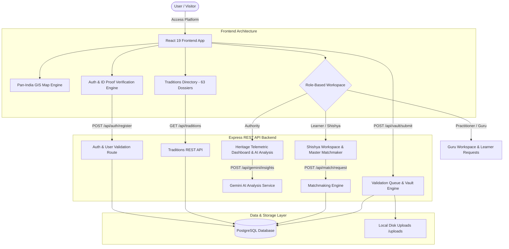

# Sanskriti Suraksha (संस्कृती सुरक्षा)
### AI-Powered Pan-India Living Heritage Early Warning & Knowledge Transmission System

[](https://react.dev/)
[](https://vitejs.dev/)
[](https://nodejs.org/)
[](https://www.postgresql.org/)
[](https://tailwindcss.com/)
[](https://ai.google.dev/)

An innovative cultural intelligence and transmission platform built to identify, assess, and safeguard India's endangered living intangible cultural heritage (ICH).

> 📖 **Looking for comprehensive documentation & system architecture?**  
> Check out the complete system manual, REST API schemas, and workflow diagrams in [**FULL_DETAILS.md**](./FULL_DETAILS.md).

---

## 🌟 Core Highlights

- 🗺️ **Pan-India Living Heritage Map**: Authentic political map of India with interactive spatial coordinate mapping across **11 focus states** (Maharashtra, Kerala, Gujarat, Madhya Pradesh, Himachal Pradesh, Punjab, Assam, Uttar Pradesh, Delhi, Bihar, and Odisha), zone filters, and live risk-coded tradition pins.
- 🎭 **63 Curated Living Traditions**: Comprehensive multimedia dossiers spanning **5 active top-level categories**:
  - 🗣️ **Oral Traditions** (21 items - *Powada, Pandavani, Dayro, Qawwali, Villu Paattu, etc.*)
  - 👗 **Traditional Clothes** (18 items - *Paithani & Nauvari, Muga Silk, Phulkari, Banarasi Katan, Patola, Kasavu, etc.*)
  - 🪔 **Traditional Festival** (9 items - *Rongali Bihu, Dev Deepawali, Baisakhi, Thrissur Pooram, Kullu Dussehra, Ganesh Chaturthi, etc.*)
  - 🍲 **Traditional Food** (9 items - *Puran Poli, Sadya, Makki di Roti, Gujarati Thali, Awadhi Dum Pukht, Kangri Dham, Litti Chokha, etc.*)
  - 🎨 **Art** (6 items - *Warli Art, Madhubani Art, Gond Painting, Tanjore Painting, Pattachitra, Kangra Painting*)
- 📡 **Early Warning Risk Engine**: Multi-factor composite Cultural Health Score (0-100) evaluating practitioner strength, youth participation, practice frequency, training availability, and archival depth.
- 🤖 **Gemini AI Gap Analysis**: AI-powered decay velocity forecasting, root-cause analysis, and policy recommendation generation.
- 🤝 **Guru-Shishya Transmission Matchmaker**: Master-to-apprentice mentorship connection pipeline with status tracking.
- 🗄️ **Knowledge Vault & Peer Verification Queue**: Decentralized cultural archiving with elder/peer community validation queues before indexing.
- ⚡ **Production REST API Backend**: Express + PostgreSQL relational database with Multer disk storage and backend-enforced registration & ID proof verification.

---

## 🔄 System Workflow Overview



---

## ⚡ Quick Start

### 1. Clone & Enter Repository
```bash
git clone https://github.com/Tanish09-tech/Heritage-.git
cd Heritage-
```

### 2. Install & Start Full Stack (Backend + Frontend)
```bash
# Run both backend API (port 5000) and frontend App (port 5173/5174) concurrently
npm run dev
```

Or run them individually:
```bash
# Start Express Backend API (Port 5000)
npm run backend

# Start Vite Frontend Dev Server
npm run frontend
```
Open `http://localhost:5173/` or `http://localhost:5174/` in your browser.

---

## 📄 Documentation Index
- Detailed System Specs & Architecture: [FULL_DETAILS.md](./FULL_DETAILS.md)
- REST API Backend Server: `backend/server.js`
- PostgreSQL Database Service: `backend/src/services/postgresDb.js`
- Living Traditions Data Layer: `frontend/src/data/heritageData.js`
- Interactive Map Component: `frontend/src/components/HeritageMapView.jsx`

---

## 🔐 Demo Test Credentials & Security Rules

The backend includes 11 pre-seeded fixed demo accounts for instant testing.

> ⚠️ **Backend Registration Enforcement**: New users (Shishyas & Gurus) **must complete registration** with mandatory profile details (Name, DOB, State, Hobbies/Experience) and Government ID Proof selection before logging in. The backend strictly blocks login attempts for unregistered emails with HTTP 401.

### 🎓 5 Student (Shishya) Credentials
| Role | Name | Email | Password | Mandatory Onboarding Details |
| :--- | :--- | :--- | :--- | :--- |
| **Shishya 1** | Aniket Deshmukh | `shishya1@sanskriti.gov.in` | `password123` | **DOB**: `2002-05-15`, **State**: `Maharashtra`<br/>**Hobbies**: `Shahiri Powada recitation, Daf percussion` |
| **Shishya 2** | Simran Kaur | `shishya2@sanskriti.gov.in` | `password123` | **DOB**: `2003-11-20`, **State**: `Punjab`<br/>**Hobbies**: `Phulkari folk embroidery, Giddha folk dance` |
| **Shishya 3** | Aarav Patel | `shishya3@sanskriti.gov.in` | `password123` | **DOB**: `2001-09-10`, **State**: `Gujarat`<br/>**Hobbies**: `Bhavai vesha acting, Garba drumming` |
| **Shishya 4** | Meera Menon | `shishya4@sanskriti.gov.in` | `password123` | **DOB**: `2004-03-08`, **State**: `Kerala`<br/>**Hobbies**: `Koodiyattam facial expressions, Mizhavu drumming` |
| **Shishya 5** | Bishal Saikia | `shishya5@sanskriti.gov.in` | `password123` | **DOB**: `2002-12-14`, **State**: `Assam`<br/>**Hobbies**: `Bihu Dhol playing, Pepa flute` |

### 🧘 5 Master (Guru) Credentials
| Role | Name | Email | Password | Mandatory Onboarding Details |
| :--- | :--- | :--- | :--- | :--- |
| **Guru 1** | Shahir Tukaram Jagtap | `guru1@sanskriti.gov.in` | `password123` | **State**: `Maharashtra`, **DOB**: `1968-08-20`<br/>**Experience**: `28 Years`, **Expertise**: `Shahiri Powada` |
| **Guru 2** | Ustad Harinder Singh | `guru2@sanskriti.gov.in` | `password123` | **State**: `Punjab`, **DOB**: `1965-03-12`<br/>**Experience**: `32 Years`, **Expertise**: `Gatka & Folk Rhythms` |
| **Guru 3** | Pandit Raghunath Joshi | `guru3@sanskriti.gov.in` | `password123` | **State**: `Gujarat`, **DOB**: `1970-11-05`<br/>**Experience**: `25 Years`, **Expertise**: `Bhavai Folk Theatre` |
| **Guru 4** | Guru Manikandan Nair | `guru4@sanskriti.gov.in` | `password123` | **State**: `Kerala`, **DOB**: `1967-04-18`<br/>**Experience**: `30 Years`, **Expertise**: `Koodiyattam Sanskrit Theatre` |
| **Guru 5** | Shrimati Hemlata Gogoi | `guru5@sanskriti.gov.in` | `password123` | **State**: `Assam`, **DOB**: `1972-09-25`<br/>**Experience**: `22 Years`, **Expertise**: `Rongali Bihu & Folk Arts` |

### 🏛️ 1 Admin / Authority Credential
| Role | Name | Email | Password | Onboarding Details |
| :--- | :--- | :--- | :--- | :--- |
| **Admin** | Dr. Rajesh Sharma | `admin@sanskriti.gov.in` | `adminpassword123` | **Role**: `AUTHORITY`, **State**: `Delhi`<br/>**Designation**: `Director of Living Heritage, Ministry of Culture` |
